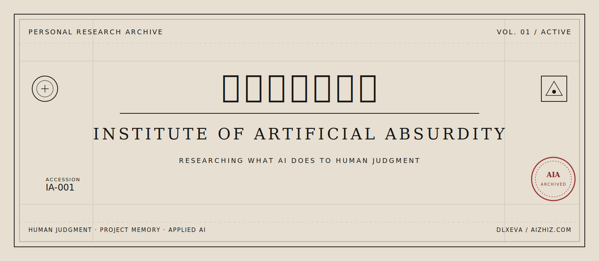

 

<strong>This archive studies what AI does to human judgment—and builds systems that keep judgment, project state, and delivery decisions traceable.</strong>

 
 

<code>RESEARCH · PROTOCOLS · ANALYSIS · FIELD SYSTEMS</code>

 

---

 

<code>ACCESSION RECORDS</code>

 

<table>
  <thead>
    <tr>
      <th align="left"><code>NO.</code></th>
      <th align="left"><code>TYPE</code></th>
      <th align="left"><code>TITLE</code></th>
      <th align="left"><code>STATUS</code></th>
    </tr>
  </thead>
  <tbody>
    <tr>
      <td><code>001</code></td>
      <td>RESEARCH</td>
      <td><a href="https://papers.ssrn.com/sol3/papers.cfm?abstract_id=6928698"><strong>Human-RLAIF</strong> — Human Reinforcement Learning from AI Feedback</a></td>
      <td><code>Preprint</code></td>
    </tr>
    <tr>
      <td><code>002</code></td>
      <td>PROTOCOL</td>
      <td><a href="https://github.com/dlxeva/FlowGrid"><strong>FlowGrid</strong> — Project-State Context Engine</a></td>
      <td><code>Active</code></td>
    </tr>
    <tr>
      <td><code>003</code></td>
      <td>ANALYSIS</td>
      <td><a href="https://github.com/dlxeva/biz-retro-analyzer"><strong>Biz Retro Analyzer</strong> — Evidence-First Dialogue Intelligence</a></td>
      <td><code>Active</code></td>
    </tr>
    <tr>
      <td><code>004</code></td>
      <td>FIELD SYSTEM</td>
      <td><a href="https://github.com/dlxeva/fde-operator-os"><strong>Applied AI Operator OS</strong> — Delivery Framing for Operational AI</a></td>
      <td><code>Active</code></td>
    </tr>
  </tbody>
</table>

 

---

 

<code>FIG. 01 — RESEARCH SPECIMEN</code>

### Human-RLAIF

**Question** — What happens when humans are repeatedly trained by AI feedback?

A longitudinal self-case study based on three years of GPT conversations, examining how AI feedback reshapes questioning strategies, judgment frameworks, and identity coordinates.

→ [Read the paper](https://papers.ssrn.com/sol3/papers.cfm?abstract_id=6928698)

 

---

 

<code>FIG. 02 — PROTOCOL SPECIMEN</code>

### FlowGrid

**Question** — How can long-running AI projects preserve judgment without reloading raw conversation history?

A local project-state context engine that keeps decisions, rationale, pending changes, and current project state traceable across sessions and agents.

→ [Open repository](https://github.com/dlxeva/FlowGrid)

 

---

 

<code>FIG. 03 — ANALYSIS SPECIMEN</code>

### Biz Retro Analyzer

**Question** — How do we audit messy project conversations without smoothing away evidence and disagreement?

Turns raw conversations into supported facts, participant claims, influence chains, judgment audits, and next actions.

→ [Open repository](https://github.com/dlxeva/biz-retro-analyzer)

 

---

 

<code>FIG. 04 — FIELD SYSTEM SPECIMEN</code>

### Applied AI Operator OS

**Question** — How do we turn an ambiguous customer problem into a delivery-worthy AI operating loop?

A reusable operator playbook for qualifying AI opportunities, modeling operational reality, defining human-in-the-loop boundaries, and compressing broad ideas into testable delivery loops.

→ [Open repository](https://github.com/dlxeva/fde-operator-os)

 

---

 

<code>CURATOR'S NOTE</code>

**Research first. Build what survives contact with reality.**

Writing and field notes at [aizhiz.com](https://aizhiz.com).

 

---

 

<code>FORMERLY — Tencent Games publishing, ten years in marketing and content.</code>

 
 

